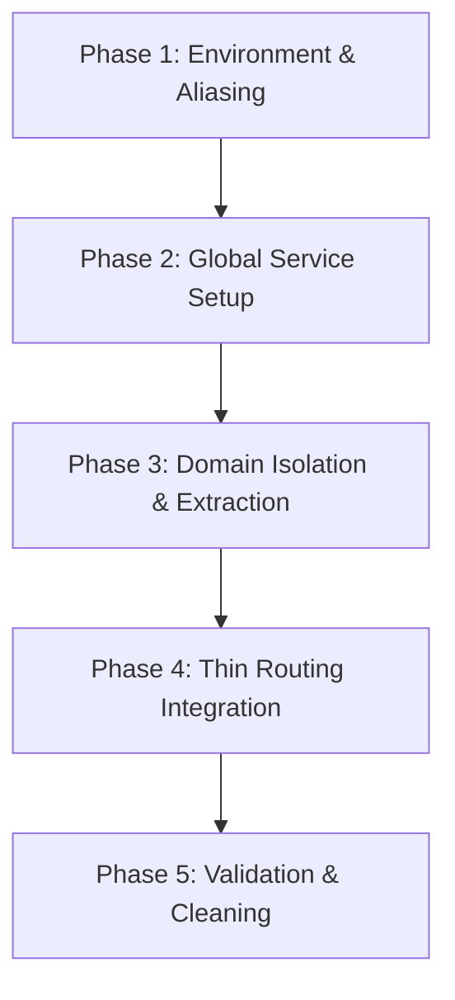

# Next.js Features-Driven Architecture Refactoring Blueprint

This blueprint outlines a highly structured, scalable, and maintainable path to refactor the **Yuugen Console** frontend into a senior-level, domain-driven (features-driven) codebase. By implementing a strict separation of concerns, we isolate UI representation from state-management hooks and pure API services, reducing complexity, eliminating circular dependencies, and paving the way for easier testing.

---

## 1. Directory Restructuring: Visual Mapping

Below is the comparative mapping of where files currently live versus where they will live under the **Features-Driven** structure inside a root `src/` directory.

### Current Directory Structure (Flat/Technical Types)
```
frontend/
├── app/
│   ├── callback/
│   ├── guild-settings/
│   ├── login/
│   ├── player/                      <-- Massive monolithic page
│   └── layout.tsx
├── components/
│   ├── decks/                       <-- MusicDeck, EconomyDeck, GamesDeck, SettingsDeck
│   └── guild-settings/
├── hooks/
│   ├── use-dashboard.ts             <-- Monolithic 400+ line state hook
│   ├── use-login.ts
│   └── use-player.ts
├── services/
│   └── guild-settings.service.ts    <-- Partially isolated settings service
├── types/
│   └── guild-settings.ts
└── tsconfig.json
```

### Target Directory Structure (Domain-Driven, Co-located)
```
frontend/
└── src/
    ├── app/                         # Next.js App Router (Thin Routing Layer Only)
    │   ├── layout.tsx               # Global providers (Theme, Auth, Query)
    │   ├── page.tsx                 # Landing / Redirect logic
    │   ├── login/
    │   │   └── page.tsx             # Renders <LoginForm /> from features/auth
    │   ├── callback/
    │   │   └── page.tsx             # Renders <OAuthCallback /> from features/auth
    │   └── player/
    │       └── page.tsx             # Console Hub (Assembles features: music, economy, settings, games)
    │
    ├── features/                    # Domain Boundaries (Self-contained Business Contexts)
    │   ├── auth/                    # Domain: Authentication (Tokens, JWT, OAuth)
    │   ├── guilds/                  # Domain: Server selection, guild metadata
    │   ├── music/                   # Domain: Player controls, volume, playlist, Lavalink sync
    │   ├── economy/                 # Domain: Balance, shop, daily claims, work, gambles
    │   ├── games/                   # Domain: Trivia sessions, Rock Paper Scissors arena
    │   └── settings/                # Domain: Server Settings Config (Prefix, Anti-Spam, etc.)
    │       ├── components/          # Domain-specific UI Presentation
    │       │   └── SettingsDeck.tsx
    │       ├── hooks/               # Domain-specific State and Mutative hooks
    │       │   └── useSettings.ts
    │       ├── services/            # Domain-specific API interaction, fetchers, and transformers
    │       │   └── settingsService.ts
    │       ├── types/               # Domain-specific TS Type Guarding
    │       │   └── settings.types.ts
    │       └── index.ts             # Public API (Public Barrel exporting selected items)
    │
    ├── components/                  # Shared/Global Presentation System (No domain/business logic)
    │   └── ui/                      # Atomic elements (Button, Input, Dropdown, Modal, Card)
    │
    ├── services/                    # Shared Technical Utilities (No domain constraints)
    │   └── apiClient.ts             # Base Axios / Fetch instance handling headers & 401 interceptors
    │
    └── types/                       # Shared/Global Types
        └── common.types.ts          # Page layout contracts, API errors, standard response frames
```

---

## 2. Phase-by-Phase Step-by-Step Migration Plan

Refactoring a running Next.js application requires a methodical, incremental approach to prevent breaking the local dev server. Follow these five sequential phases.



### Phase 1: Environment, Aliasing & Root setup
1. **Create the `src/` directory** at the root of `frontend/`.
2. **Update `tsconfig.json`** to redirect the `@/*` paths to target the `src` folder:
   ```json
   "paths": {
     "@/*": ["./src/*"]
   }
   ```
3. **Move global directories** (`app/`, `components/`, `hooks/`, `services/`, `types/`) into the new `src/` directory.
   - *Note: Ensure your code editor automatically updates imports during this move.*
4. **Test the build immediately** with `npm run build` or `npm run dev` to verify the alias mappings and Next.js compiler resolution are working perfectly with the `src/` folder active.

### Phase 2: Establish the Shared Core
1. **Create `src/services/apiClient.ts`** to house the central Fetch or Axios wrapper. Remove the inline environment variables (`NEXT_PUBLIC_API_URL`, `NEXT_PUBLIC_API_KEY`) and authentication header composition found in hooks like `use-dashboard.ts`.
2. **Create atomic components in `src/components/ui/`**. Extract pure UI elements from components (like server selector dropdowns, custom scrollbar wrappers, or loaders) so they are reusable and decoupled from domain state.

### Phase 3: Incremental Feature Extraction (Domain by Domain)
Do *not* try to refactor all features at once. Extract them one at a time. Let's use the **Settings** domain as the first candidate:
1. Create `src/features/settings/types/settings.types.ts` and define domain interfaces.
2. Create `src/features/settings/services/settingsService.ts` containing settings-related async fetch calls utilizing the central `apiClient`.
3. Create `src/features/settings/hooks/useSettings.ts` using react-hooks to handle loading states, success messages, and execute calls to `settingsService`.
4. Move `SettingsDeck.tsx` from `src/components/decks/` into `src/features/settings/components/SettingsDeck.tsx` and strip away any props that are now managed internally by `useSettings`.
5. Create `src/features/settings/index.ts` to export only the hook and component.

### Phase 4: Route Adaptation (Thin App Router Layers)
1. Navigate to the page route directories inside `src/app/` (e.g., `src/app/player/page.tsx`).
2. Replace monolithic page layouts with thin coordinating components. A page component should do nothing but import features and render them inside a structural layout:
   ```tsx
   import { MusicFeature } from "@/features/music";
   import { SettingsFeature } from "@/features/settings";
   // Routing files only coordinate layout structures and active tabs
   ```

### Phase 5: Clean Up and Verify
1. Delete empty legacy directories (e.g., old flat `hooks/use-dashboard.ts` once all sub-domains are extracted).
2. Run standard lint checks (`npm run lint`) to resolve orphaned import paths.
3. Validate overall features behavior (e.g., check that changing servers updates the settings panel and economy components correctly without state bleeding).

---

## 3. Concrete Code Examples: Separation of Concerns

To demonstrate the power of this separation, here is how the **Server Settings** features will look before and after.

### 🔴 BEFORE (Tight Coupling & Bloat)
In the original structure:
1. **API endpoints** (`http://localhost:3001/api/v1/settings`) and headers configuration were defined dynamically inside the massive `hooks/use-dashboard.ts` hook.
2. **State & Actions** (`settings`, `settingsMessage`, `updateSettings`) were bundled in `useDashboard` which loaded economy, games, and player systems all at once.
3. **UI Elements** (`SettingsDeck.tsx`) accepted the entire set of states and handlers via prop-drilling, resulting in complex component signatures and unnecessary re-renders.

### 🟢 AFTER (Highly Decoupled, Co-located Feature Structure)

#### File 1: Central HTTP Client (`src/services/apiClient.ts`)
A global shared client that takes care of routing requests, handling authorization headers, and managing automatic logouts.

```typescript
// src/services/apiClient.ts

const API_URL = process.env.NEXT_PUBLIC_API_URL || "http://localhost:3001/api/v1";
const API_KEY = process.env.NEXT_PUBLIC_API_KEY || "";

interface FetchOptions extends RequestInit {
  bodyData?: Record<string, any> | any;
}

export async function apiClient<T>(endpoint: string, options: FetchOptions = {}): Promise<T> {
  const token = typeof window !== "undefined" ? localStorage.getItem("access_token") : null;
  
  const headers = new Headers(options.headers);
  headers.set("Content-Type", "application/json");
  headers.set("x-api-key", API_KEY);
  
  if (token) {
    headers.set("Authorization", `Bearer ${token}`);
  }

  const config: RequestInit = {
    ...options,
    headers,
  };

  if (options.bodyData) {
    config.body = JSON.stringify(options.bodyData);
  }

  const response = await fetch(`${API_URL}${endpoint}`, config);

  if (response.status === 401) {
    if (typeof window !== "undefined") {
      localStorage.removeItem("access_token");
      window.location.href = "/login";
    }
    throw new Error("Unauthorized session. Redirecting to login...");
  }

  if (!response.ok) {
    const errorData = await response.json().catch(() => ({}));
    throw new Error(errorData.message || `API error: ${response.status}`);
  }

  return response.json() as Promise<T>;
}
```

#### File 2: Feature Types (`src/features/settings/types/settings.types.ts`)
Types restricted purely to the Server Settings domain.

```typescript
// src/features/settings/types/settings.types.ts

export interface GuildSettings {
  guildId: string;
  prefix: string;
  welcomeChannelId: string | null;
  welcomeMessage: string;
  antiSpamEnabled: boolean;
  profanityFilterEnabled: boolean;
  blacklistedWords: string[];
}

export interface SettingsStatusMessage {
  text: string;
  success: boolean;
}
```

#### File 3: Domain Service Layer (`src/features/settings/services/settingsService.ts`)
Pure fetch interactions using standard data transformers. Completely isolated from component state and browsers logic.

```typescript
// src/features/settings/services/settingsService.ts
import { apiClient } from "@/services/apiClient";
import { GuildSettings } from "../types/settings.types";

export const settingsService = {
  /**
   * Fetch settings configurations for a specific Discord Guild
   */
  async getSettings(guildId: string): Promise<GuildSettings> {
    return apiClient<GuildSettings>(`/settings?guildId=${guildId}`, {
      method: "GET",
    });
  },

  /**
   * Update settings configuration for a specific Discord Guild
   */
  async updateSettings(guildId: string, settings: Partial<GuildSettings>): Promise<GuildSettings> {
    return apiClient<GuildSettings>("/settings", {
      method: "POST",
      bodyData: {
        guildId,
        settings,
      },
    });
  },
};
```

#### File 4: Custom Domain Hook (`src/features/settings/hooks/useSettings.ts`)
Encapsulates all react-state, validation, logic, and asynchronous handling, keeping components lightweight.

```typescript
// src/features/settings/hooks/useSettings.ts
import { useState, useEffect, useCallback } from "react";
import { GuildSettings, SettingsStatusMessage } from "../types/settings.types";
import { settingsService } from "../services/settingsService";

export function useSettings(guildId: string | undefined) {
  const [settings, setSettings] = useState<GuildSettings | null>(null);
  const [isLoading, setIsLoading] = useState<boolean>(false);
  const [error, setError] = useState<string | null>(null);
  const [feedbackMessage, setFeedbackMessage] = useState<SettingsStatusMessage | null>(null);

  const fetchSettings = useCallback(async () => {
    if (!guildId) return;
    setIsLoading(true);
    setError(null);
    try {
      const data = await settingsService.getSettings(guildId);
      setSettings(data);
    } catch (err: any) {
      setError(err.message || "Failed to load guild configurations.");
    } finally {
      setIsLoading(false);
    }
  }, [guildId]);

  const saveSettings = async (updatedFields: Partial<GuildSettings>) => {
    if (!guildId) return;
    setFeedbackMessage(null);
    try {
      const updatedData = await settingsService.updateSettings(guildId, updatedFields);
      setSettings(updatedData);
      setFeedbackMessage({ text: "Guild configurations saved successfully!", success: true });
    } catch (err: any) {
      setFeedbackMessage({ 
        text: err.message || "Failed to save guild configurations.", 
        success: false 
      });
    }
  };

  // Automatically fetch settings whenever the selected server changes
  useEffect(() => {
    fetchSettings();
  }, [guildId, fetchSettings]);

  return {
    settings,
    isLoading,
    error,
    feedbackMessage,
    setFeedbackMessage,
    refetch: fetchSettings,
    saveSettings,
  };
}
```

#### File 5: Clean UI Component (`src/features/settings/components/SettingsDeck.tsx`)
Pure layout representation. Pulls its own context directly using the custom hook, bypassing page prop-drilling entirely.

```typescript
// src/features/settings/components/SettingsDeck.tsx
"use client";

import React, { useState } from "react";
import { Shield, Save, Loader2, Sparkles, AlertCircle } from "lucide-react";
import { useSettings } from "../hooks/useSettings";

interface SettingsDeckProps {
  selectedGuildId: string;
}

export function SettingsDeck({ selectedGuildId }: SettingsDeckProps) {
  const { 
    settings, 
    isLoading, 
    error, 
    feedbackMessage, 
    saveSettings, 
    setFeedbackMessage 
  } = useSettings(selectedGuildId);

  // Local form buffers for instant typing input response
  const [prefixInput, setPrefixInput] = useState("");
  const [welcomeMsgInput, setWelcomeMsgInput] = useState("");

  // Sync state once server loaded
  React.useEffect(() => {
    if (settings) {
      setPrefixInput(settings.prefix);
      setWelcomeMsgInput(settings.welcomeMessage);
    }
  }, [settings]);

  if (isLoading) {
    return (
      <div className="flex-1 flex flex-col items-center justify-center py-20">
        <Loader2 className="w-8 h-8 text-brand-secondary animate-spin mb-4" />
        <span className="text-white/40 text-xs font-mono tracking-widest uppercase">Fetching server rules...</span>
      </div>
    );
  }

  if (error) {
    return (
      <div className="flex-1 flex flex-col items-center justify-center py-20 text-red-400">
        <AlertCircle className="w-8 h-8 mb-4 text-red-500" />
        <span className="text-xs font-mono uppercase tracking-wider">{error}</span>
      </div>
    );
  }

  const handleSave = () => {
    saveSettings({
      prefix: prefixInput,
      welcomeMessage: welcomeMsgInput,
    });
  };

  return (
    <div className="w-full flex flex-col space-y-6">
      {/* Visual Feedback Message popups */}
      {feedbackMessage && (
        <div className={`p-4 rounded-xl border flex items-center gap-3 text-xs tracking-wider transition ${
          feedbackMessage.success 
            ? "bg-emerald-500/10 border-emerald-500/25 text-emerald-400" 
            : "bg-red-500/10 border-red-500/25 text-red-400"
        }`}>
          <span>{feedbackMessage.text}</span>
          <button onClick={() => setFeedbackMessage(null)} className="ml-auto opacity-50 hover:opacity-100">×</button>
        </div>
      )}

      {/* Main Settings Panel layout details */}
      <div className="bg-[#0b141d]/60 border border-white/5 rounded-2xl p-6">
        <div className="flex items-center gap-3 mb-6">
          <Shield className="w-5 h-5 text-brand-secondary" />
          <h2 className="text-sm font-bold tracking-widest uppercase text-white">Guild Configuration</h2>
        </div>

        <div className="space-y-6">
          {/* Prefix Configuration Input */}
          <div className="flex flex-col space-y-2">
            <label className="text-[10px] uppercase font-bold tracking-widest text-white/50">Command Prefix</label>
            <input
              type="text"
              value={prefixInput}
              onChange={(e) => setPrefixInput(e.target.value)}
              className="bg-[#04080c] border border-white/10 rounded-xl px-4 py-3 text-sm text-white focus:outline-none focus:border-brand-secondary/40 transition"
              maxLength={5}
            />
          </div>

          {/* Welcome Message Input */}
          <div className="flex flex-col space-y-2">
            <label className="text-[10px] uppercase font-bold tracking-widest text-white/50">Welcome Greeting Message</label>
            <textarea
              value={welcomeMsgInput}
              onChange={(e) => setWelcomeMsgInput(e.target.value)}
              className="bg-[#04080c] border border-white/10 rounded-xl px-4 py-3 text-sm text-white focus:outline-none focus:border-brand-secondary/40 transition h-24 resize-none"
            />
          </div>

          {/* Save Configurations Trigger */}
          <button
            onClick={handleSave}
            className="flex items-center justify-center gap-2 w-full py-3 bg-brand-secondary/15 hover:bg-brand-secondary/25 border border-brand-secondary/30 rounded-xl transition text-xs font-bold uppercase tracking-widest text-brand-secondary"
          >
            <Save className="w-4 h-4" />
            <span>Save Rules</span>
          </button>
        </div>
      </div>
    </div>
  );
}
```

---

## 4. Clean Export Guidelines & Barrel Files

To prevent deep and fragile nested path imports (like `import { SettingsDeck } from '../../../../features/settings/components/SettingsDeck'`), we use **Barrel Files (`index.ts`)** and Next.js compiler-backed absolute mapping.

### Rule 1: Expose ONLY the Public API
Inside `src/features/settings/index.ts`, explicitly export only the items other domains or routing components need. Keep implementation files (like sub-components, types, and hooks that are internal to this domain) concealed.

```typescript
// src/features/settings/index.ts

// Export presentation entry-point
export { SettingsDeck } from "./components/SettingsDeck";

// Export hook only if other features need settings details
export { useSettings } from "./hooks/useSettings";

// Export base interfaces
export type { GuildSettings } from "./types/settings.types";
```

### Rule 2: Importing into the App Layer
With the barrel file active and path aliases configured, you can import this feature cleanly anywhere inside `app/` like this:

```typescript
// Clean, atomic imports
import { SettingsDeck } from "@/features/settings";
```

### Rule 3: Strict Cross-Feature Rules (Zero Circular Dependencies)
To ensure features are truly self-contained:
1. **Never** import internal directories from other features (e.g., do *not* write `import { ... } from "@/features/economy/components/BalanceCard"` inside `src/features/settings`).
2. If two features need to share code, **move the shared logic** up to the shared core:
   - Shared UI goes to `src/components/ui/`
   - Shared hooks go to `src/hooks/`
   - Shared fetching tools go to `src/services/`
3. If Feature A needs access to Feature B's states, pass it through the parent coordinating page (the routing layer `src/app/player/page.tsx`) or utilize a shared React Context/State Manager.

---

## 5. Architectural Quality Checklist

Before completing your refactoring of a single domain, check these metrics:

| Metric Checklist | Standard for Senior-Level |
| :--- | :--- |
| **Monolithic Hook Count** | Removed entirely. Each hook represents a single specific feature. |
| **JSX Cleanliness** | No async requests, token reads, or math calculations inside JSX components. |
| **Fetch Duplication** | None. Standard fetch processes run through the consolidated `apiClient.ts`. |
| **Path Nesting** | Absolute paths (`@/features/...`) preferred everywhere over relative paths (`../../`). |
| **Component Co-location** | All files exclusive to a feature are housed strictly within its specific sub-directory. |
